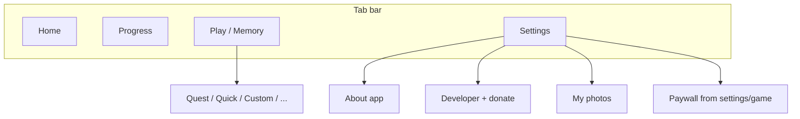

# Pairloom — спецификация экранов для Figma

Документ описывает, как собрать **страницу проекта** в Figma: токены, размеры фреймов, перечень экранов и иерархию блоков по текущему коду (Ionic + кастомная тема).

## Как использовать

1. В Figma создайте файл **Pairloom** (или добавьте страницу **App screens** в существующий файл).
2. Создайте коллекцию **Variables** (режимы **Light** / **Dark**) по таблице ниже.
3. Для каждого экрана — фрейм **Mobile** шириной **390** px, высота **844** px (или **852** с safe area). Нижняя **Tab bar** высотой **~56** px + safe area.
4. Соберите **локальные компоненты**: `Card / Default`, `Button / Primary`, `Button / Outline`, `List row / Navigation`, `Tab bar`, `Section header` (title + subtitle как в `ion-card-header`).

## Дизайн-токены (зеркало `src/theme/variables.scss` + `global.scss`)

| Токен | Light | Dark (палитра Ionic dark) |
|--------|--------|----------------------------|
| Primary | `#3B82F6` | `#60A5FA` |
| Secondary | `#8B5CF6` | (при необходимости осветлить для контраста) |
| Tertiary / Success | `#16A34A` | — |
| Warning | `#D97706` | — |
| Danger | `#DC2626` | — |
| Background | `#FFFFFF` | фон Ionic dark (по умолчанию тёмно-серый из темы) |
| Text | `#111827` | светлый текст темы |
| Card border | primary @ ~32% mix white | primary @ ~45% mix background |
| Card radius | **20** px | |
| Card shadow | `0 10px 24px` rgba(17,24,39,0.08) | `0 10px 24px` rgba(0,0,0,0.35) |
| Button radius | **14** px | |
| Space scale | 4, 8, 12, 16, 24, 32 px | `--app-space-1` … `--app-space-6` |

**Шрифты**

- Заголовки / кнопки / `ion-title`: **Bangers** (fallback: Segoe UI, system-ui).
- Моно (если нужен в UI): **IBM Plex Mono** 400/600.

**Отступы контента**

- Верх страницы: не меньше **12** px или safe-area (класс `page-safe-top`).
- Горизонтальный padding контента: **ion-padding** ≈ **16** px.

## Нижняя навигация (всегда на основных вкладках)

Четыре пункта, порядок слева направо:

| Иконка (Ionic outline) | Подпись (EN) |
|------------------------|--------------|
| `home-outline` | Home |
| `trophy-outline` | Progress |
| `grid-outline` | Play |
| `settings-outline` | Settings |

## Каталог фреймов (что нарисовать)

Рекомендуемый порядок слева направо на странице Figma — по пользовательскому потоку.

### 1. Home (`/tabs/home`)

- Блок бренда: логотип-mark 88×88, wordmark ~280×54 (`assets/brand/` — вставить как SVG/PNG).
- Hero: крупный заголовок (Bangers), подзаголовок body.
- Карточка **Streak & personal best**: заголовок, подзаголовок, строка серии с эмодзи огня, лучшее время или muted «ещё нет», опционально «последняя сессия N ч назад».
- Три кнопки на всю ширину: **100-level quest** (solid + badge «Path complete» при успехе), **Quick solo** (outline), **Custom game** (outline).

### 2. Progress (`/tabs/progress`)

- Заголовок + подзаголовок страницы.
- Несколько карточек-метрик: streak, stars, games finished, фильтры (chips), таблица лидерборда мультиплеера (пустое состояние — отдельный вариант).

### 3. Play hub (`/tabs/memory`)

- Заголовок «Play» / хаб выбора режима.
- Кнопки режимов: Quest, Quick solo, Panic, Horror, Custom (как в `memory.page` — свериться с актуальным HTML).
- Состояния: лобби, кастомный мастер (шаги), игровое поле с сеткой карточек (показать **4×4** и вариант **6×6** как отдельные фреймы).

### 4. Settings (`/tabs/settings`)

Секции в `ion-card` с заголовком и подзаголовком:

- Account & app: премиум-кнопка / chip, имя игрока, язык.
- Game: сетка, лица карт, тема, коллекции фото → строка «Manage collections».
- Display: тёмная тема, типографика hero/body, рубашка карты, размер карты, memorize preview.
- **About**: «About this app», «Developer & support» (строки списка с иконками + chevron).
- Footer: email поддержки, кнопки Privacy / Terms (clear, small).

### 5. About this app (`/tabs/settings/about-product`)

- Стрелка назад + заголовок.
- Одна карточка: lead-текст, маркированный список из 3 пунктов, версия по центру (muted).

### 6. Developer (`/tabs/settings/developer`)

- Назад + заголовок.
- Карточка с текстом (lead + body).
- Карточка «Tip the developer»: subtitle-подсказка, кнопка с иконкой heart-outline, вторичная outline «Website»; варианты **ссылки заданы** / **не заданы** (disabled + hint).

### 7. My photos (`/tabs/settings/my-photos`) — Premium

- Тулбар назад + заголовок.
- Карточка коллекций: чипы альбомов, действия rename/delete.
- Сетка миниатюр + превью (по структуре `my-photos.page.html`).

### 8. Paywall (`/paywall`)

- Заголовок премиум, hero, список фич, CTA подписка / lifetime, restore, legal links, dev-toggle (можно пометить как «только dev»).

## Компоненты Figma (минимум)

1. **App screen shell**: фон, safe area, слот контента, слот tab bar.
2. **DS Card**: header slot + content slot, стили границы и тени как выше.
3. **DS Button / Large**: solid и outline.
4. **DS List item**: иконка слева, label, chevron справа (для About-ссылок).
5. **DS Chip** (для фильтров / коллекций).
6. **Memory card tile** (рубашка / открытая пара) — для игрового поля.

## Автоматизация через Cursor + Figma MCP

Если подключить Figma plugin в Cursor и выполнить **аутентификацию MCP**, можно генерировать те же фреймы скриптом (`use_figma`) по этой спецификации. После входа откройте целевой файл в Figma и попросите ассистента: «создай фреймы по docs/figma-pairloom-screens.md в файле …».

## Быстрая схема информационной архитектуры

Файлы-источники в репозитории: `src/app/home/`, `progress/`, `features/memory/`, `settings/`, `paywall/`, `tabs/`, тема `src/theme/variables.scss`, глобально `src/global.scss`.
